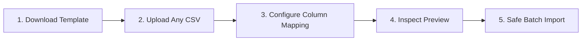

# Modena Product Importer — Administrator User Guide

Welcome to the **Modena Product Importer**. This dedicated WordPress Admin interface allows you to upload any product CSV spreadsheet (up to **500MB**), visually map and adjust columns with smart auto-detection, preview live validations, monitor real-time upload speeds (MB/s & Mbps), and import products safely into WooCommerce.

---

## 🖼️ Universal Image Parsing Support

The importer automatically detects, decodes, and attaches product images in **any** format:

| Image Format | Example Value in CSV | Behavior |
| :--- | :--- | :--- |
| **Base64 Data URI** | `data:image/png;base64,iVBORw0KGgoAAAANSU...` | Decodes raw binary, creates a media library attachment (`.png`, `.jpg`, `.webp`), and attaches to product. |
| **Raw Base64** | `iVBORw0KGgoAAAANSUhEUgAA...` | Automatically detects binary signature, creates attachment, and updates featured/gallery images. |
| **Remote URL** | `https://example.com/images/blender.jpg` | Downloads image securely, stores in WordPress uploads, and generates responsive thumbnails. |
| **Local File Path** | `catalog_assets/product_1_img_1.jpeg` or full path | Copies local asset into WordPress Media Library and links to product. |

---

## 📍 Where to Find the Importer

1. Log into your WordPress Admin Dashboard (`/wp-admin`).
2. In the left navigation sidebar, navigate to:
   **Products → Modena Importer**
   (`wp-admin/edit.php?post_type=product&page=modena-product-importer`)

---

## 🚀 5-Step Import Workflow

### Step 1: Download Template or Clean Trash (Optional)
* **Download Blank CSV Template** — A clean 17-column spreadsheet ready to fill.
* **Download Example CSV** — A pre-filled template with real sample products.
* **Empty Trash (1-Click)** — Permanently purge trashed products to avoid duplicate SKU conflicts.

### Step 2: Upload CSV
1. Drag and drop your `.csv` file into the upload dropzone (or click anywhere in the box / the "Browse File" button to browse).
2. Supports files **up to 500MB** (including Base64 image data).
3. Click **Upload & Configure Column Mapping →**.
4. The live progress bar tracks upload percentage (`%`), uploaded data size (`MB / MB`), and real-time network transfer speed (`MB/s` & `Mbps`).

### Step 3: Configure Column Mapping
The importer automatically auto-detects matching columns based on common header names:
* Each field shows a dropdown of the columns found in your uploaded file.
* Next to each dropdown, a **live sample preview** shows data from your actual file.
* If a column from your vendor CSV is named differently (e.g. `Item Name` instead of `name`, or `MRP` instead of `regular_price`), simply select the matching column from the dropdown.
* If there are columns you do not want to import, select `-- Do Not Import / Skip --`.
* Click **Validate & Preview Data →**.

### Step 4: Inspect Preview & Choose Duplicate Action
1. Review the summary metrics:
   * **Total Products**
   * **Valid Rows**
   * **Errors Found** (if any, with exact row numbers and helpful fixes).
2. Choose your **Duplicate Product Strategy**:
   * **Update Existing Product** (recommended) — Overwrites/refreshes price, description, images, and custom specs if a product with the same SKU or Name already exists.
   * **Skip Existing Product** — Leaves existing products untouched and only creates new items.
3. Click **Start Safe Product Import Now**.

### Step 5: Safe Sequential Batch Import
* The importer processes products in memory-safe sequential batches (2 products per chunk) to eliminate server 500 errors and PHP timeouts.
* Watch real-time progress (`Importing product 4 of 15 (27%)...`).
* Receive a final status report (`Processed: 15 | Created: 12 | Updated: 3 | Failed: 0`).
* Click direct links to view imported products in **WooCommerce Admin** or on the **Live Website**.
