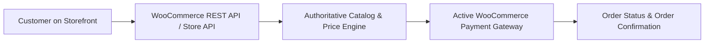

# WooCommerce Native Payment System & Settings Guide

## 1. Overview
The Modena website uses **WooCommerce's native payment gateway architecture**. Instead of a detached third-party payment flow, the React storefront dynamically retrieves and renders the exact payment gateways configured inside WooCommerce, and creates orders directly through WooCommerce's authoritative order & payment processing engine.

---

## 2. Managing Payment Gateways in WordPress

All payment methods displayed on the storefront are managed directly inside the WordPress Admin:

**WordPress Admin → WooCommerce → Settings → Payments**
(`wp-admin/admin.php?page=wc-settings&tab=checkout`)

### Available & Supported Gateways

| Gateway ID | Gateway Name | Description | Default Status |
| :--- | :--- | :--- | :--- |
| **`cod`** | **Cash on Delivery** | Customer pays upon physical delivery of the parcel. | **Enabled** (Default) |
| **`bacs`** | **Direct Bank Transfer** | Customer transfers funds to your bank account using Order Number as reference. | **Enabled** |
| **`cheque`** | **Check Payments** | Customer sends cheque to store billing address. | **Enabled** |
| **`razorpay`** | **Razorpay (Official WC Plugin)** | Secure UPI, Credit/Debit Cards, NetBanking through official WooCommerce Razorpay plugin. | **Configured** |
| **`ppcp-gateway`** | **PayPal** | International PayPal checkout. | Disabled |

---

## 3. How to Enable or Disable a Payment Method

1. Go to **WooCommerce → Settings → Payments**.
2. Find the payment method (e.g. **Cash on delivery**, **Direct bank transfer**, or **Razorpay**).
3. Toggle the **Enabled** switch to ON or OFF.
4. Click **Save changes** at the bottom.
5. The React storefront will automatically update its payment options to match your WooCommerce configuration.

---

## 4. Configuring Individual Gateways

### A. Cash on Delivery (`cod`)
1. Click **Manage** next to *Cash on delivery*.
2. Customize the **Title** (e.g. `Cash on delivery`) and **Description** (e.g. `Pay with cash upon delivery`).
3. Set **Instructions** (e.g. `Please keep exact cash ready upon BlueDart delivery`).
4. Click **Save changes**.

### B. Direct Bank Transfer (`bacs`)
1. Click **Manage** next to *Direct bank transfer*.
2. Add your company's bank account details (Account Name, Account Number, Bank Name, IFSC / Sort Code, IBAN).
3. Any instructions entered here are automatically delivered to the customer on the React Order Confirmation screen and in the automated order confirmation email.

### C. Razorpay Official WooCommerce Gateway (`razorpay`)
1. Click **Manage** next to *Razorpay*.
2. **Test Mode / Sandbox**:
   - Check **Enable Test Mode** to test online payments with test UPI/Cards.
   - Enter your Test Key ID and Test Key Secret.
3. **Live Mode / Production**:
   - Uncheck **Enable Test Mode**.
   - Enter your Live Key ID and Live Key Secret from the Razorpay Dashboard.
4. **Webhook Configuration**:
   - The webhook URL generated by WooCommerce (e.g. `https://yourdomain.com/?wc-api=WC_Razorpay`) should be added to **Razorpay Dashboard → Settings → Webhooks**.
   - Enable events: `payment.authorized`, `order.paid`, `refund.created`.

---

## 5. Order Management & Status Tracking

Every order placed from the React frontend creates an official record in WooCommerce:

**WordPress Admin → WooCommerce → Orders**

### Standard Order Status Flow:
1. **`Processing`**: Order placed and confirmed (e.g. COD orders or completed online payments). Ready for packing and dispatch.
2. **`On Hold`**: Order placed awaiting payment receipt (e.g. Bank Transfer / Check payments). Once funds clear, admin marks status to `Processing`.
3. **`Completed`**: Shipment dispatched and delivered.
4. **`Cancelled / Refunded`**: Order cancelled or refunded.

---

## 6. Price & Payment Security Guarantees
* **Server-Side Authoritative Pricing**: Product prices, taxes, discounts, and order subtotals are calculated strictly by the WooCommerce core engine from catalog postmeta. Frontend values are never trusted for payment capture.
* **Zero Credential Exposure**: No secret keys, CVVs, or card credentials pass through or are stored in React.
* **Full Audit Trail**: Every transaction ID, payment method title, and timestamp is securely recorded in the WooCommerce order note history.
