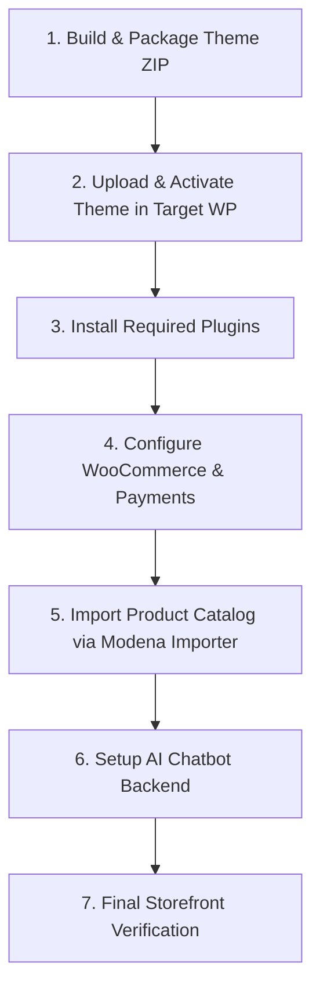

# Modena React Theme — Complete Deployment Guide

This step-by-step guide explains how to deploy the **Modena React WordPress Theme** and the **AI Chatbot RAG Service** to another person's WordPress environment or remote production server.

---

## 📋 Quick Deployment Workflow



---

## 🛠️ Step 1: Build & Package the Theme into a ZIP

Before handing the theme to the other person, generate the latest production build and package only the clean theme files (excluding `node_modules`, `.git`, and `_project_extras`).

### 1.1 Run the Production Build
Open your terminal in `modena-react-theme` and run:
```bash
npm run build
```
This compiles the React application and copies the compiled assets directly into `assets/` and `dist/`.

### 1.2 Generate the Ready-to-Upload Theme ZIP
You can create the clean zip file automatically using PowerShell:
```powershell
Compress-Archive -Path "assets", "catalog_assets", "dist", "inc", "parts", "templates", "functions.php", "index.html", "index.php", "style.css", "theme.json", "package.json", "README.md", "MODENA_PRODUCT_IMPORT_GUIDE.md", "WOOCOMMERCE_PAYMENT_SETUP.md" -DestinationPath "..\modena-react-theme.zip" -Force
```
*(This creates `modena-react-theme.zip` right outside the folder, ready to send to the client/administrator).*

---

## 🌐 Step 2: Upload & Activate the Theme on the Target WordPress

The person managing the target WordPress website can install the theme using either of the following methods:

### Option A: Via WordPress Admin Dashboard (Recommended)
1. Log into the target **WordPress Admin Dashboard** (`https://yourdomain.com/wp-admin`).
2. In the left sidebar, navigate to **Appearance → Themes**.
3. Click the **Add New Theme** button at the top, then click **Upload Theme**.
4. Choose the `modena-react-theme.zip` file and click **Install Now**.
5. Once uploaded, click **Activate**.

### Option B: Via FTP / cPanel / File Manager
1. Connect to the hosting server via FTP or cPanel File Manager.
2. Navigate to:
   ```text
   /wp-content/themes/
   ```
3. Upload and extract the `modena-react-theme` folder here so the path is:
   ```text
   /wp-content/themes/modena-react-theme/
   ```
4. Log into WordPress Admin, go to **Appearance → Themes**, and click **Activate** under **Modena React Theme**.

---

## 🔌 Step 3: Install Required WordPress Plugins

Ensure the target WordPress site has the following essential plugins installed and activated:

1. **WooCommerce** *(Mandatory)*:
   * Go to **Plugins → Add New Plugin**, search for `WooCommerce`, click **Install Now**, and then **Activate**.
   * Run through the basic setup wizard (select India / INR ₹ as currency).
2. **Razorpay for WooCommerce** *(For online card & UPI payments)*:
   * Search for `WooCommerce Razorpay` in the plugin repository, click **Install Now**, and **Activate**.

---

## 💳 Step 4: Configure WooCommerce & Payment Gateways

The theme natively uses WooCommerce's authoritative payment system (Cash on Delivery is automatically disabled).

1. Go to **WooCommerce → Settings → Payments**.
2. **Razorpay** (Online Payments):
   * Click **Manage** next to Razorpay.
   * Enter your live or sandbox **Key ID** and **Key Secret** from your [Razorpay Dashboard](https://dashboard.razorpay.com/).
   * Enable Webhooks if prompted.
3. **Direct Bank Transfer (BACS)** *(Optional)*:
   * Enable BACS if you accept direct NEFT/RTGS bank transfers and enter your bank account details.
4. **Cheque Payments** *(Optional)*:
   * Enable if accepting offline cheques.
5. Go to **Settings → Permalinks** in WordPress Admin and click **Save Changes** (this ensures all REST API endpoints like `/wp-json/wc/store/v1/products` and `/wp-json/modena/v1/create-wc-order` are flushed and active).

---

## 📦 Step 5: Import Products via the Built-In Modena Importer

The target store does not need manual product data entry. You can import the complete catalog in 1 click:

1. In WordPress Admin, go to **Products → Modena Importer** (`/wp-admin/edit.php?post_type=product&page=modena-product-importer`).
2. Click **Browse File from Computer** and select your product CSV spreadsheet (supports up to **500MB** and Base64 images).
3. Click **Upload & Configure Column Mapping →** to view the live upload speed and detected columns.
4. Review your mapping dropdowns and click **Validate & Preview Data →**.
5. Select **Update Existing Product** and click **Start Safe Product Import Now**.
6. The importer will automatically:
   * Decode and attach all high-resolution featured and gallery images.
   * Categorize products into the official categories: **Mixer Grinder**, **Nutrimix**, and **Cookware**.
   * Save technical specifications, dimensions, USPs, and included components to custom product metadata.

---

## 🤖 Step 6: Deploy the AI Chatbot RAG Service (Optional / Recommended)

The AI assistant runs as a high-performance Python FastAPI service connected to ChromaDB.

### 6.1 Install Dependencies
On the target server, navigate to `rag-backend/`:
```bash
cd rag-backend
pip install -r requirements.txt
```

### 6.2 Configure Environment Variables
Create or edit `rag-backend/.env`:
```ini
GEMINI_API_KEY=your_google_gemini_api_key_here
CHROMA_PERSIST_DIR=./chroma_db
TOP_K=4
MAX_SESSION_HISTORY=10
```

### 6.3 Sync WooCommerce Catalog to Vector DB
Run the synchronization script to index all WooCommerce products into ChromaDB:
```bash
python sync_rag_catalog.py
```

### 6.4 Run RAG Backend as a Daemon Process (PM2 or Systemd)
Using PM2:
```bash
pm2 start "python -m uvicorn main:app --host 0.0.0.0 --port 8000" --name modena-ai-rag
pm2 save
```
*(Or configure an Nginx reverse proxy to forward `/api/v1/` requests from port 80/443 to `http://127.0.0.1:8000`)*.

---

## 🔍 Step 7: Final Storefront Verification Checklist

Visit the live website frontend (`https://yourdomain.com/`) and verify:

- [ ] **Homepage & Navigation**: Hero banner slider loads, and navbar links (`Home`, `Mixer Grinder`, `Nutrimix`, `Cookware`, `More`) filter products correctly.
- [ ] **Product Detail Page**: Clicking a product opens the detail view with images, price, included components, specifications, and USP bullet points.
- [ ] **Dynamic Add to Cart**: Clicking **ADD TO CART** transforms into `[ - ] [ <QTY> IN CART ] [ + ]` and cart count badge updates.
- [ ] **Checkout Modal**: Opening the cart drawer and clicking **PROCEED TO CHECKOUT** opens the modal and displays active payment gateways.
- [ ] **Order Creation**: Placing a test order creates an authoritative order under **WooCommerce → Orders** in the WordPress Admin.
- [ ] **AI Chatbot**: Clicking the floating chatbot button allows asking questions about products, prices, and recommendations.

---

## ❓ Troubleshooting & FAQs

### Q: REST API or Checkout returns 404
* **Solution**: Go to **WordPress Admin → Settings → Permalinks**, choose **Post name**, and click **Save Changes** to flush rewrite rules.

### Q: Large CSV upload fails with "File exceeds upload_max_filesize"
* **Solution**: In `php.ini` or cPanel PHP Settings, ensure:
  ```ini
  upload_max_filesize = 256M
  post_max_size = 256M
  memory_limit = 512M
  max_execution_time = 300
  ```

### Q: Images in CSV are not appearing
* **Solution**: The Modena Importer supports remote image URLs, local file paths, and Base64 Data URIs (`data:image/png;base64,...`). Ensure image strings in the CSV are complete and accessible.
